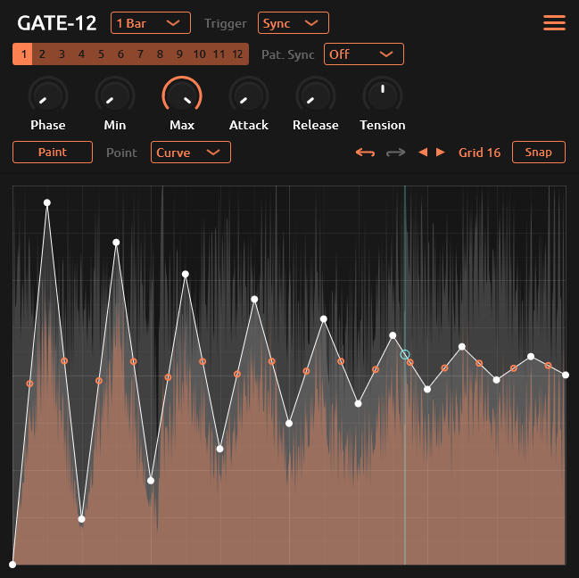

<h1 align="center">
  <!--  -->
  GATE-12
  <br>
</h1>
<div align="center">

[](https://github.com/tiagolr/gate12/releases)
[](https://github.com/tiagolr/gate12/releases)
[](https://github.com/tiagolr/gate12/releases)

</div>
<div align="center">

[](https://github.com/tiagolr/gate12/releases/latest)


</div>

GATE-12 is an open-source and cross-platform envelope generator for gate/volume control inspired by plugins like GrossBeat and ShaperBox. It is a port of [GATE-1](https://github.com/tiagolr/gate1) to _JUCE_ framework which in turn is a port of [GATE-1 JSFX](https://github.com/tiagolr/tilr_jsfx?tab=readme-ov-file#gate-1) for the Reaper DAW.

<div align="center">



</div>

## Whats new

  * **Cross-platform** available on Windows, macOS and Linux
  * **Presets** included
  * **Built with JUCE**
  * **Audio trigger** use audio transients to trigger the envelope
  * **Pattern sync** sync pattern changes to beat position

## Features

  * Multi-segment editor
  * 12 patterns triggered by midi notes
  * Paint mode - erase, line, saw up, saw down ..
  * Point type - hold, curve, s-curve, stairs ..
  * Tempo sync or lfo rate (Hz)
  * Attack and release smooth
  * Pre and post waveform display
  * MIDI trigger mode
  * Transient trigger mode

## Download

* [Download latest release](https://github.com/tiagolr/gate12/releases)
* Current builds include VST3 and LV2 for Windows, Linux and macOS plus AU for macOS.
* Clap is planned when there is official [JUCE support](https://juce.com/blog/juce-roadmap-update-q3-2024/).

## Tips

  * Ctrl for fine adjustments
  * Double click to reset sliders
  * Shift to toggle snap on/off
  * Mouse wheel on view to change grid size
  * Right click points to change point type
  * Ctrl + right click view to erase points
  * Right click view to paint using paint tool
  * Alt + Right click to erase points

## About

With version 2 this plugin was rebuilt from scratch using JUCE for its cross-platforms capabilities and overall development tools/processes.

## MacOS

MacOS builds are untested and unsigned, please let me know of any issues by opening a ticket, don't expect a promptly fix as I don't have access to that OS.

Because the builds are unsigned you may have to run the following commands:

```bash
sudo xattr -dr com.apple.quarantine /path/to/your/plugins/gate12.component
sudo xattr -dr com.apple.quarantine /path/to/your/plugins/gate12.vst3
sudo xattr -dr com.apple.quarantine /path/to/your/plugins/gate12.lv3
```

The commands above will recursively remove the quarantine flag from the plugins.

## Build

```bash
git clone --recurse-submodules https://github.com/tiagolr/gate12.git

# windows
cmake -G "Visual Studio 17 2022" -DCMAKE_BUILD_TYPE=Release -S . -B ./build

# linux
sudo apt update
sudo apt-get install libx11-dev libfreetype-dev libfontconfig1-dev libasound2-dev libxrandr-dev libxinerama-dev libxcursor-dev
cmake -G "Unix Makefiles" -DCMAKE_BUILD_TYPE=Release -S . -B ./build
cmake --build ./build --config Release

# macOS
cmake -G "Unix Makefiles" -DCMAKE_BUILD_TYPE=Release -DCMAKE_OSX_ARCHITECTURES="x86_64;arm64" -S . -B ./build
cmake --build ./build --config Release
```
